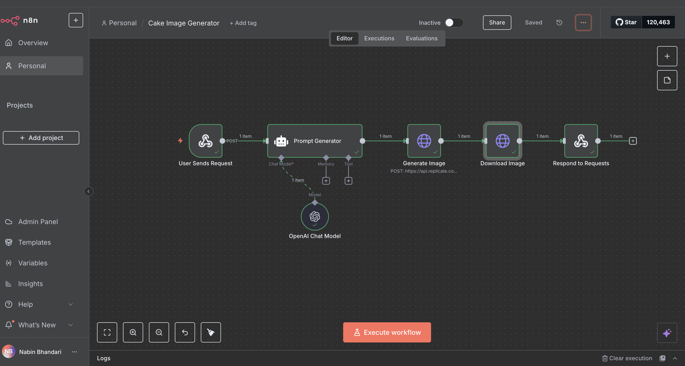

# AI Cake Creator Web App

# 🎂 AI Cake Creator

Transform any name or occasion into a **custom AI-generated cake design**!  
This project combines **AI prompt engineering**, **image generation**, and **automation** to create unique and magical cake designs based on user input.

  

---

## 🚀 **Live Demo**
👉 [AI Cake Creator](https://calm-cendol-1a3ff2.netlify.app)

---

## 🛠 **Tech Stack**
- **Frontend:** [Bolt.new](https://bolt.new) (Next.js-based UI framework)  
- **Backend:** [n8n](https://n8n.io) (Workflow automation)  
- **AI Models:**  
  - **OpenAI GPT** – For creative prompt generation.  
  - **Replicate.com** – For generating high-quality cake images.  
- **Hosting:** Netlify (Frontend)

---

## ⚙ **How It Works**
1. **User Input:**  
   A user enters a name or special occasion (e.g., *Sarah’s Birthday*) on the web app.
   
2. **n8n Workflow Trigger:**  
   The frontend sends a **POST request** to n8n, triggering the automation workflow.

3. **Prompt Generation:**  
   Using **OpenAI Chat Model**, a creative and visually rich cake design prompt is generated.  
   **Example:**  
   *“Create a birthday cake image with Sarah’s name in chocolate frosting, pink roses, and sparkles.”*

4. **Image Creation:**  
   The prompt is passed to **Replicate’s AI Image Model** to generate a custom cake design.

5. **Delivery:**  
   n8n downloads the image and sends it back to the frontend, where the user sees their **magical cake masterpiece**.

---

## 🧩 **Workflow Overview**
The n8n workflow consists of:  
- **Webhook Trigger** – Captures user input.  
- **OpenAI Chat Model** – Creates a detailed prompt.  
- **Replicate Image Generator** – Generates the cake image.  
- **Download Image & Respond** – Sends the image back to the frontend.

---

## ✨ **Features**
- AI-powered custom cake designs.
- End-to-end automation – no manual steps.
- Scalable and can be extended to other products like T-shirts or greeting cards.

---

## 📬 **Contact**
Want something like this for your business?  
**Email:** nabin7358@gmail.com

